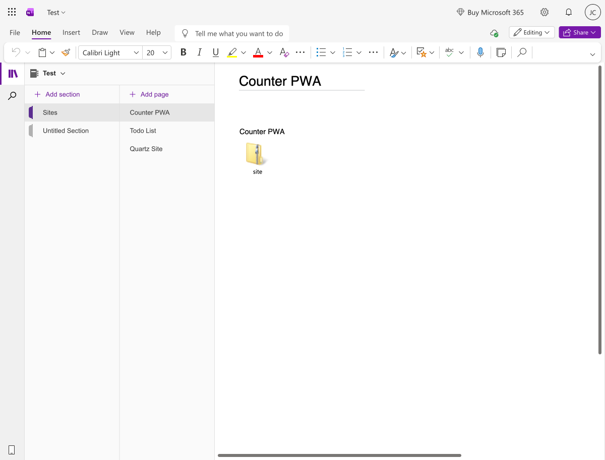
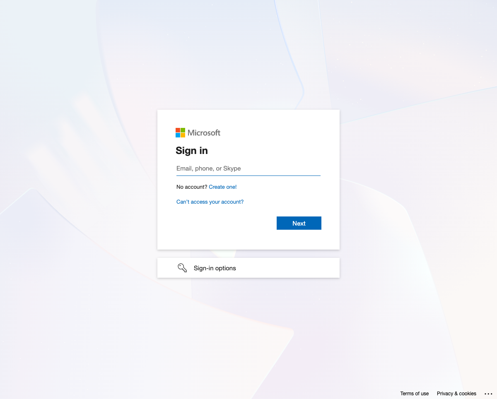
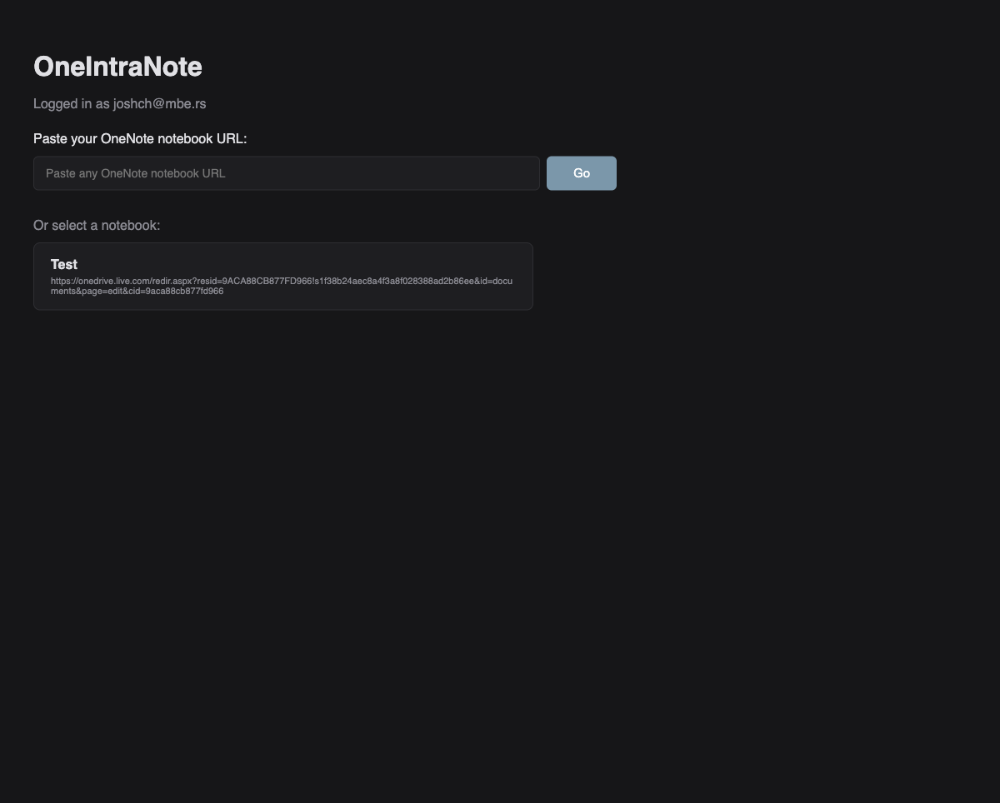
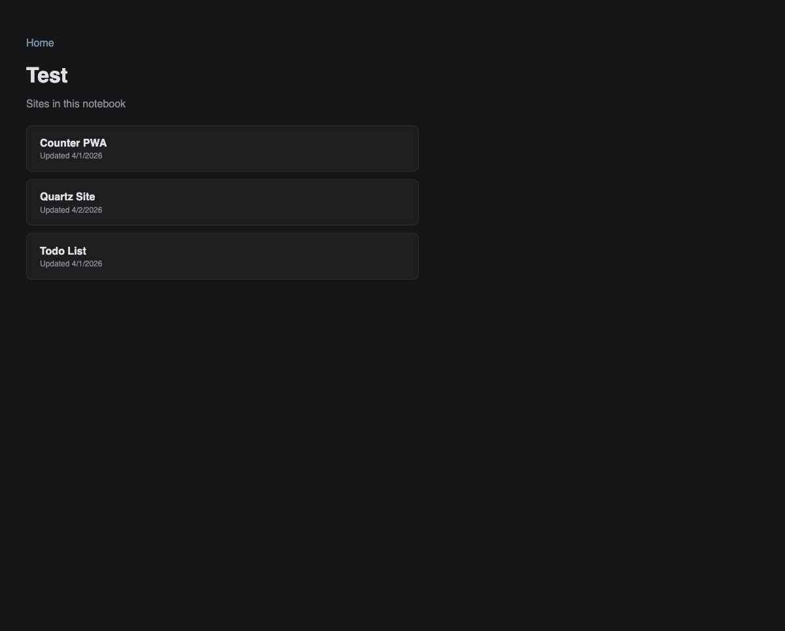
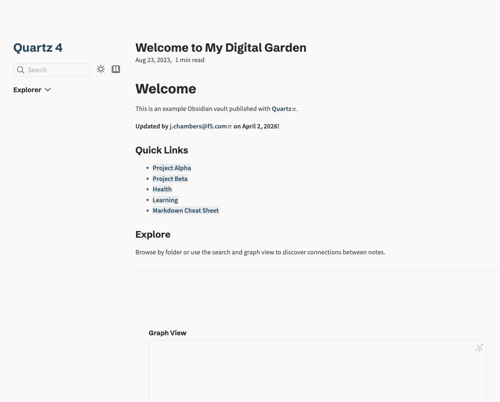

# OneIntraNote

Host static websites from OneNote notebooks. Any static site gets zipped and stored as a OneNote page attachment. The web app downloads the zip, unpacks it in the browser, and serves it via a service worker — fullscreen, with working navigation and PWA support.

Access control is handled by OneNote sharing. If someone can read the notebook, they can view the site.

## Viewing a shared site

Someone shared a OneIntraNote link with you? Follow these steps:

### Step 1: Open the shared notebook in OneNote

Check your email for the OneNote sharing notification and open the notebook. This is a **one-time step** — it adds the notebook to your Microsoft account so OneIntraNote can find it.

### Step 2: Click the OneIntraNote link and sign in

Click the link your colleague sent you. You'll see a sign-in page — click **"Sign in with Microsoft"** and use your Microsoft account.

### Step 3: Browse notebooks

After signing in, you'll see notebooks that have published sites. Select the one your colleague shared with you.

### Step 4: Choose a site

The notebook's published sites are listed. Click the one you want to view.

### Step 5: View the site

The site loads fullscreen in your browser. Navigate, search, and interact with it just like any website.

That's it. No software to install, no accounts to create beyond your existing Microsoft account.

## Publishing sites

Want to publish your own sites and share them with your team? See the [Publisher Guide](https://github.com/j-chambers-f5/oneintranote/blob/main/PUBLISHING.md).

## How it works

- **No server** — runs entirely in the browser
- **No admin consent** — `Notes.Read` is user-consentable on any Microsoft account
- **Multi-tenant** — works with personal and organizational accounts
- **Stale-while-revalidate** — cached sites load instantly, updates fetch in the background
- **PWA support** — sites with a `manifest.json` can be installed as standalone apps
